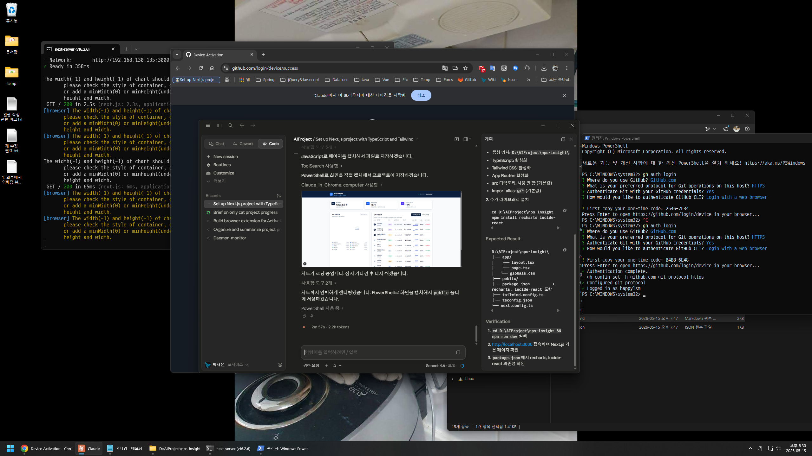

<div align="center">

# 📊 NPS Insight

**국민연금 포트폴리오 인사이트 대시보드**

공시 데이터 기반으로 국민연금의 주요 보유 종목을 한눈에 파악하는 금융 분석 대시보드

[](https://nextjs.org)
[](https://www.typescriptlang.org)
[](https://tailwindcss.com)
[](https://recharts.org)
[](LICENSE)

</div>

---

## 🖥️ 대시보드 미리보기



> 다크 네이비 기반의 전문 금융 서비스 UI — 요약 카드, 도넛 차트, 상세 테이블을 한 화면에 제공합니다.

---

## 🎯 프로젝트 소개

**NPS Insight**는 대한민국 최대 기관투자자인 **국민연금공단(NPS)** 의 주식 포트폴리오를 시각적으로 분석하는 대시보드입니다.

국민연금은 약 **1,000조 원** 이상의 자산을 운용하며 국내 주식시장에서 막강한 영향력을 행사합니다. 그러나 이 정보는 공시 PDF나 텍스트 데이터로만 제공되어 일반 투자자가 직관적으로 파악하기 어렵습니다.

NPS Insight는 이 공시 데이터를 **시각화·구조화**하여 다음을 가능하게 합니다:

- 국민연금이 어떤 종목을 **얼마나 보유**하고 있는지 즉시 파악
- 전분기 대비 **지분 변동 추이** 모니터링
- **5% 이상 지분 보유 종목** (실질 주주 영향력 보유 종목) 별도 확인

---

## ✨ 주요 기능

### 📌 요약 카드 (Summary Cards)
| 카드 | 내용 |
|------|------|
| **총 운용자산** | 국민연금 전체 AUM (조 원 단위) |
| **국내주식 비중** | 전체 포트폴리오 내 국내주식 비율 (%) |
| **주요변동 종목 수** | 전분기 대비 지분 증가·감소 종목 집계 |

### 📊 보유 비중 차트
- **Recharts DonutChart** 기반 인터랙티브 파이 차트
- 평가액 상위 10개 종목의 포트폴리오 비중 시각화
- 호버 시 종목명·평가액·포트폴리오 비중 툴팁 표시

### 📋 상세 보유 현황 테이블
- **탭 전환**: 평가액 상위 10 ↔ 5% 이상 지분 보유 종목
- 표시 컬럼: 순위, 종목명/코드, 섹터 뱃지, 보유 주식수, 평가액, 포트 비중(인라인 바), 지분율, 전분기 대비 변동
- 가로 스크롤 지원으로 모든 데이터 접근 가능

### 🏗️ 데이터 레이어 분리
- `getNPSData()` 함수로 데이터 로직 완전 분리
- 현재 `DUMMY_DATA` 기반 → **실제 API 교체 시 함수 내부만 수정**하면 UI 변경 없이 연동 가능

---

## 🛠️ 기술 스택

| 분류 | 기술 | 버전 |
|------|------|------|
| **Framework** | Next.js (App Router) | 16.x |
| **Language** | TypeScript | 5.x |
| **Styling** | Tailwind CSS | v4 |
| **Chart** | Recharts | 3.x |
| **Icons** | Lucide React | 1.x |
| **Font** | Geist (Vercel) | - |
| **Runtime** | Node.js | 24.x |

---

## 📁 프로젝트 구조

```
nps-insight/
├── app/
│   ├── _components/
│   │   └── NPSDashboard.tsx   # 'use client' — 전체 대시보드 UI
│   ├── _lib/
│   │   └── getNPSData.ts      # 데이터 레이어 (타입 정의 + DUMMY_DATA + 함수)
│   ├── layout.tsx             # 루트 레이아웃 (메타데이터, 폰트)
│   ├── page.tsx               # 서버 컴포넌트 — getNPSData 호출 후 대시보드 렌더링
│   └── globals.css            # Tailwind v4 전역 스타일
├── public/
│   └── preview.png            # 대시보드 스크린샷
├── package.json
└── tsconfig.json
```

---

## 🚀 설치 및 실행

### 사전 요구사항
- **Node.js** 18.17 이상 (권장: v24.x LTS)
- **npm** 9 이상

### 1. 저장소 클론

```bash
git clone https://github.com/happylsm/nps-insight.git
cd nps-insight
```

### 2. 의존성 설치

```bash
npm install
```

### 3. 개발 서버 실행

```bash
npm run dev
```

브라우저에서 [http://localhost:3000](http://localhost:3000) 으로 접속하세요.

### 4. 프로덕션 빌드

```bash
npm run build
npm run start
```

---

## 🔌 실제 API 연동 방법

현재는 `DUMMY_DATA`로 동작합니다. 실제 API로 교체할 때는 `app/_lib/getNPSData.ts` 파일만 수정하면 됩니다.

```ts
// app/_lib/getNPSData.ts

export async function getNPSData(): Promise<NPSData> {
  // 기존 DUMMY_DATA 반환 코드를 아래로 교체
  const res = await fetch(`${process.env.NPS_API_URL}/holdings`, {
    next: { revalidate: 3600 }, // 1시간 캐시
  })
  return res.json()
}
```

`.env.local` 파일을 생성하고 API URL을 추가하세요:

```env
NPS_API_URL=https://your-api-endpoint.com
```

---

## 💡 핵심 가치와 인사이트

### 🔍 왜 국민연금 데이터인가?

국민연금은 단순한 연금 기금이 아닙니다. 국내 주식시장에서 **삼성전자 지분 9.58%**, **SK하이닉스 7.33%** 등을 보유한 실질적인 **국내 최대 기관투자자**입니다. 국민연금의 매수·매도 움직임은 시장에 직접적인 영향을 미치며, 이를 추적하는 것은 **스마트 머니의 흐름을 읽는 가장 신뢰할 수 있는 방법** 중 하나입니다.

### 📈 데이터가 말하는 것

```
📌 삼성전자 단일 종목이 국민연금 전체 포트폴리오의 3.99%
   → 평가액 기준 약 40조 8,562억 원
   → 국민연금 매도 시 시장에 직접 충격

📌 5% 이상 지분 보유 = 주요 주주 지위
   → 이사회 의결권 행사 가능
   → 주주환원 정책(배당·자사주)에 영향력

📌 전분기 대비 지분율 변동
   → 증가: 해당 섹터 전략적 확대 신호
   → 감소: 차익 실현 또는 비중 조절 신호
```

### 🏛️ 기관 투자자 추적의 의의

| 지표 | 의미 |
|------|------|
| 포트폴리오 비중 상승 | 국민연금이 비중 확대 → 장기 우량주 신호 |
| 5% 이상 신규 진입 | 주주 영향력 확보 → 기업 거버넌스 개선 기대 |
| 지속적 지분 축소 | 섹터 전망 조정 또는 밸류에이션 부담 |

---

## 📄 라이선스

이 프로젝트는 [MIT License](LICENSE) 하에 배포됩니다.

---

## ⚠️ 면책 고지

본 프로젝트는 **공시 데이터 기반 정보 제공 목적**으로만 제작되었으며, **투자 권유 또는 재무 조언이 아닙니다.**
투자 결정은 본인의 판단과 책임 하에 이루어져야 합니다.

---

<div align="center">

Made with ❤️ by [happylsm](https://github.com/happylsm)

</div>
